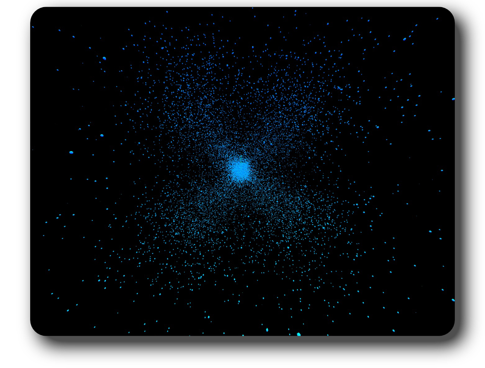
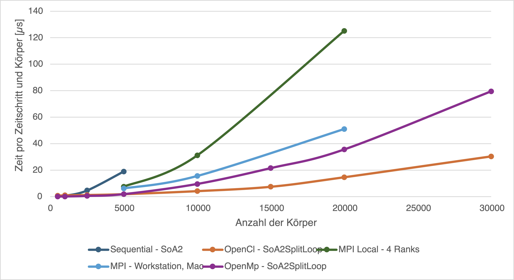
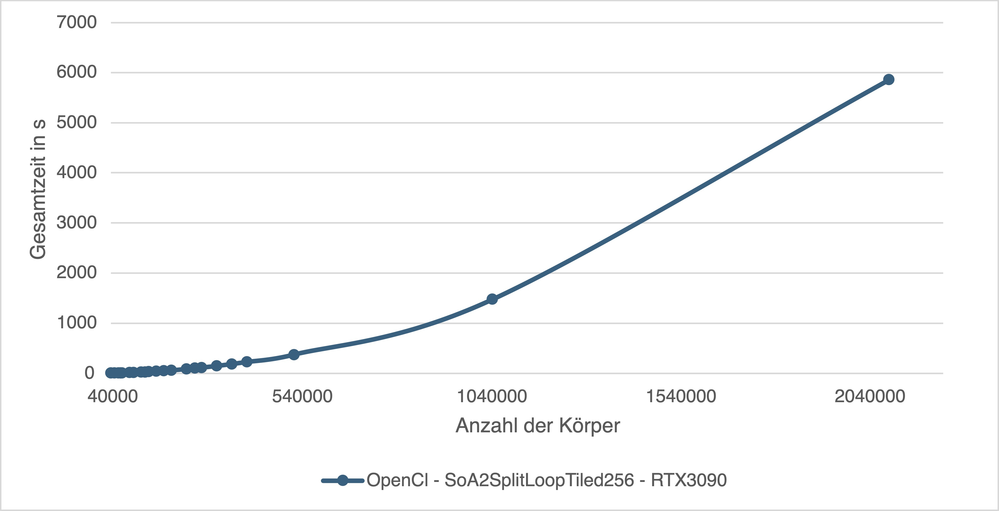

# N-Body-Problem

The n-Body-Problem is the problem in physics of calculating the movement of bodies in a system that influence each other through their gravity, e. g. motions of sun, planets and moons in a solar system. The problem has been solved for two bodies, but for three or more bodies it can - except for a few select cases - only be solved numerically through a simulation. 
[Read more on Wikipedia.](https://en.wikipedia.org/wiki/N-body_problem)

This academic project aims to simulate the n-Body-Problem in a performance-efficient way with a high focus on utilization of parallel computing technologies, and less on actual physical accuracy.

[Read the full report (German).](doc/documentation.pdf)



## Overview

*This is a short overview to help understand the codebase. For a full technical explanation read the [report (German)](doc/documentation.pdf).*

To calculate the simulation, a 'naive' algorithm was used that calculates the incoming forces from all bodies in the system for all bodies in the system. More sophisticated solutions such as the [Barnes-Hut Algorithm](https://en.wikipedia.org/wiki/Barnes%E2%80%93Hut_simulation) have been omitted due to time constraints and a focus on parallel technology analysis.

This naive algorithm was then implemented in various ways with variying degrees of parallelism to analyze performance. 
Technologies used to improve performance were *OpenMP*, *MPI* and GPU parallelism through *OpenCL*, together with techniques such as *Structure of Arrays* for better CPU vectorization or better GPU memory usage, or GPU *shared memory tiling*.

The different variants are implemented in *simulation* files under `src/source/simulations`.

## Results

Analysis shows that only the use of parallel technologies makes it feasible at all to simulate the n-Body-Problem. 
As seen in the graph below, given the right optimizations even the CPU is capable of an efficient simulation using OpenMP. 
The implemented algorithm for MPI was not fully optimized and only run across two machines, but already demonstrates potential. With full optimizations and a higher amount of similar and high-performance machines it's performance potential lies between the single OpenMP machine and OpenCL.
Maximum performance however is achieved by OpenCL. The data-parallel nature of the algorithm is perfectly suited for the parallel capabilities of the GPU. 



With full optimizations applied, the maximum amount of bodies simulated in a relatively efficient time was about 2 million, where 750 time steps took around an hour.



## Install & Run

This project requires *CMake (>= 3.28)*, *OpenMP*, *OpenCL*, *MPI SDK & Runtime* and *OpenGL* to be installed. Installation of these varies between tooling, operating systems and hardware and is therefore not covered here.

The repository contains submodules to some included dependencies, therefore clone the repository using the following command.

```sh
git clone --recursive https://github.com/Freeeezee/N-Body-Simulation.git
```

#### Executables

The project builds 4 different executables running the different `main-*.cpp` files:

- `n_body_simulation.exe`: Executes `main.cpp`. Runs a simulation and plays it afterwards in a an OpenGL window. Used algorithm and bodies can be set in the main file.
- `n_body_simulation_body_gen.exe`: Generate a starting set of bodies randomly and saves them as `generated_bodies.txt`. Can be read into `n_body_simulation.exe` or `n_body_simulation_mpi.exe`.
- `n_body_simulation_mpi.exe`: Runs the simulation in MPI. Requires a `generated_bodies.txt` in the execution directory. Executed via `mpiexec -n <N> n_body_simulation_mpi.exe`. Used algorithm and time-steps can be set in `main-mpi.cpp`.
- `n_body_simulation_test.exe`: Runs the test suite defined in `main-test.cpp`. Time measurements and deviation coefficient (if a baseline was set) are saved to `test_suite_analytics_*steps_*bodies.csv` after execution.


